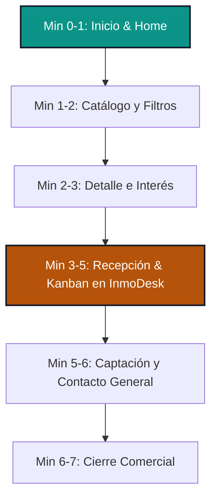

# Guion de Demostración Comercial — Altavista Propiedades + InmoDesk

Este guion está diseñado para realizar una presentación ágil, comercial y de alto impacto de **7 minutos**, mostrando la sinergia e integración en tiempo real entre el portal público **Altavista Propiedades** y el panel de control interno **InmoDesk**.

---

## Objetivo de la Demo
Demostrar que **Altavista Propiedades** no es una página web estática o aislada, sino un canal público de captación totalmente integrado a un **CRM / Panel Comercial (InmoDesk)**. El foco está en evidenciar cómo cada interacción del cliente final se convierte automáticamente en una oportunidad de negocio estructurada y gestionable sin esfuerzo manual.

---

## Dirección visual
La demo pública usa una identidad boutique/editorial con paleta cálida, fondos profundos y componentes menos genéricos para diferenciarse de landings inmobiliarias tradicionales.

---

## Frase Clave
> *"Esto no es solo una página web inmobiliaria. Es una experiencia pública conectada a un panel de gestión comercial, donde cada consulta entra automáticamente como lead y puede ser gestionada por el equipo."*

---

## Guion Sugerido de 7 Minutos

### Minuto 0:00 - 0:01 | 1. Introducción y Home
*   **Acción:** Proyectar la página de inicio de **Altavista Propiedades** (`https://altavista-demo.baselogic.cl`).
*   **Discurso:** 
    > "Buenas tardes. Hoy quiero mostrarles cómo funciona el ecosistema digital de Altavista. Lo que ven en pantalla es el portal público de cara al cliente: una experiencia boutique/editorial, cálida y premium, pensada para generar confianza inmediata. Pero lo realmente valioso no está solo en lo visual, sino en lo que ocurre por detrás..."

### Minuto 0:01 - 0:02 | 2. Catálogo y Búsqueda
*   **Acción:** Hacer clic en **Propiedades** y navegar por el catálogo. Mostrar el uso de algún filtro rápido (ej: Comuna o Venta/Arriendo).
*   **Discurso:**
    > "Navegamos al catálogo. El cliente puede filtrar propiedades de forma instantánea por comuna, operación o precio, dentro de una interfaz más cuidada que una ficha inmobiliaria genérica. Esta información no está cableada de manera estática: se consulta en tiempo real desde nuestra base de datos comercial. Si un asesor modifica un precio o sube una propiedad en el panel interno, el cambio se refleja de inmediato en esta web."

### Minuto 0:02 - 0:03 | 3. Detalle de Propiedad y Formulario de Interés
*   **Acción:** Entrar al detalle de una propiedad (ej. *Moderna Casa en San Damián* o *Lo Curro*). Desplazarse brevemente por las características y la descripción.
*   **Discurso:**
    > "Cuando un cliente se interesa en una propiedad específica, entra al detalle. Aquí cuenta con fotografías de alta resolución, fichas técnicas claras y dos alternativas de conversión directa: contactar de inmediato por WhatsApp con un mensaje preconfigurado útil, o completar nuestro formulario integrado de interés."

### Minuto 0:03 - 0:04 | 4. Generación de un Lead Real
*   **Acción:** Rellenar el formulario de interés de la propiedad con datos de prueba realistas (ej: Nombre: `Clara Montenegro`, Email: `clara.montenegro@gmail.com`, Teléfono: `+56 9 7654 3210`) y hacer clic en **Contactar Agente**. Mostrar el mensaje de éxito.
*   **Discurso:**
    > "Vamos a simular un interesado real. Completo los datos de Clara Montenegro y envío la consulta. El sistema procesa la solicitud de inmediato y le confirma a Clara que su requerimiento ha sido ingresado con éxito."

### Minuto 0:04 - 0:05 | 5. Recepción en InmoDesk
*   **Acción:** Cambiar de pestaña al panel administrativo de **InmoDesk** (`https://inmodesk-demo.baselogic.cl`) e iniciar sesión (si no está iniciada). Ir a la sección **Leads**.
*   **Discurso:**
    > "Ahora nos ponemos el sombrero del corredor de propiedades. Pasamos a nuestro panel privado InmoDesk. Al entrar a la sección de **Leads**, vemos que el registro de Clara Montenegro ingresó automáticamente, indicando que está interesada en la propiedad específica, con sus datos de contacto y sin necesidad de que nadie digite nada."

### Minuto 0:05 - 0:06 | 6. Tablero Kanban (Pipeline)
*   **Acción:** Ir a la pestaña **Pipeline** en InmoDesk. Mostrar la tarjeta de Clara en la columna *Nuevo*. Moverla brevemente a *Contacto Establecido* o *Visita Coordinada*.
*   **Discurso:**
     > "**(Frase Clave)** Esto no es solo una página web inmobiliaria. Es una experiencia pública conectada a un panel de gestión comercial, donde cada consulta entra automáticamente como lead y puede ser gestionada por el equipo. Como ven en el Pipeline comercial, Clara ya tiene una tarjeta en la etapa 'Nuevo'. Desde aquí, el agente asignado puede gestionar la oportunidad dentro del pipeline y avanzar su estado según el proceso comercial, asegurando un control absoluto del embudo de conversión."

### Minuto 0:06 - 0:06:30 | 7. Captación de Propietario e Inquietudes Generales
*   **Acción:** Regresar brevemente a Altavista e ir a `/publica-con-nosotros` o `/contacto`. Mostrar el formulario de captación detallando que funciona bajo la misma lógica.
*   **Discurso:**
    > "Este mismo flujo inteligente aplica para propietarios que desean publicar su inmueble en la sección 'Publica con Nosotros', y para consultas generales en la pestaña de 'Contacto'. Todo se centraliza en el mismo Pipeline, clasificado según el tipo de solicitud para su correcta asignación."

### Minuto 0:06:30 - 0:07 | 8. Cierre Comercial
*   **Discurso:**
    > "Con esto resolvemos el gran dolor de las corredoras: la pérdida de prospectos por correos traspapelados u hojas de cálculo obsoletas. Centralizamos la captación pública y la gestión interna en un único ecosistema ágil, profesional y listo para operar. Quedo atento a sus dudas."

---

## Límites del MVP / Qué NO prometer todavía
Para mantener expectativas realistas y proteger el alcance de esta fase de desarrollo, **no dejes de considerar** el funcionamiento de los siguientes aspectos (no prometerlos):
1.  **Multiempresa completo:** El panel está diseñado para una sola corredora boutique (Altavista) en esta etapa.
2.  **Integración automática con portales (Multipublicación):** La publicación en Portales líderes (Portal Inmobiliario, TOCTOC) es conceptual y se realiza manualmente; no hay sincronización por API bidireccional automatizada con ellos.
3.  **Gestión avanzada de imágenes:** La carga de imágenes múltiples cuenta con almacenamiento demostrativo, no con optimizadores ni CDN de alto volumen autogestionados por el usuario final todavía.
4.  **Correos automatizados:** No hay envío automático de correos (ej. alerts de nuevas propiedades o emails de bienvenida automatizados) configurado aún.
5.  **WhatsApp API oficial:** El botón abre WhatsApp web/mobile mediante enlaces directos estandarizados; no utiliza la API oficial pagada de WhatsApp Business (sin bots ni flujos automatizados de chat).
6.  **CRM Masivo de Producción:** Presentarlo como un MVP comercial / Demo funcional robusto, no como un sistema de nivel enterprise para soportar cientos de agentes en paralelo sin adaptaciones previas.

---

## Objeciones y Respuestas Comerciales

### 1. ¿Esto se puede usar con mi marca?
> **Respuesta:** "Por supuesto. Toda la interfaz del portal público y del panel administrativo son completamente personalizables (*white-label*). Podemos adaptar los logotipos, la tipografía, los colores corporativos y los textos informativos para que se alineen perfectamente con la identidad de tu corredora."

### 2. ¿Puedo cargar mis propias propiedades?
> **Respuesta:** "Sí, esa es la funcionalidad principal. A través del módulo de administración de InmoDesk, tu equipo puede crear, editar, pausar o archivar propiedades mediante un formulario sencillo. Los cambios impactarán el portal público al instante."

### 3. ¿Los leads quedan guardados?
> **Respuesta:** "Los leads quedan registrados en el panel comercial y pueden ser gestionados por el equipo. Para una operación productiva real, la persistencia puede migrarse a PostgreSQL u otra base de datos robusta."

### 4. ¿Se puede conectar a WhatsApp?
> **Respuesta:** "Sí. Actualmente contamos con una conexión directa que levanta la aplicación de WhatsApp con un mensaje estructurado con el nombre y ubicación de la propiedad. En fases posteriores, se puede integrar con proveedores oficiales de la API de WhatsApp para centralizar los chats dentro del panel."

### 5. ¿Se puede usar con varios corredores?
> **Respuesta:** "Sí. InmoDesk permite que los agentes gestionen sus leads dentro de un flujo compartido. Cada propiedad cuenta con un agente asignado, permitiendo organizar las responsabilidades de seguimiento de manera clara."

### 6. ¿Esto ya está listo para producción real?
> **Respuesta:** "El ecosistema actual es 100% funcional: los formularios conectan, las propiedades cargan en tiempo real y el Pipeline opera perfectamente. Está listo para ser desplegado con tus datos reales tras configurar tu dominio y cuentas de correo básicas. Es el punto de partida perfecto para digitalizar tu negocio sin los costos ni tiempos de un desarrollo desde cero."
